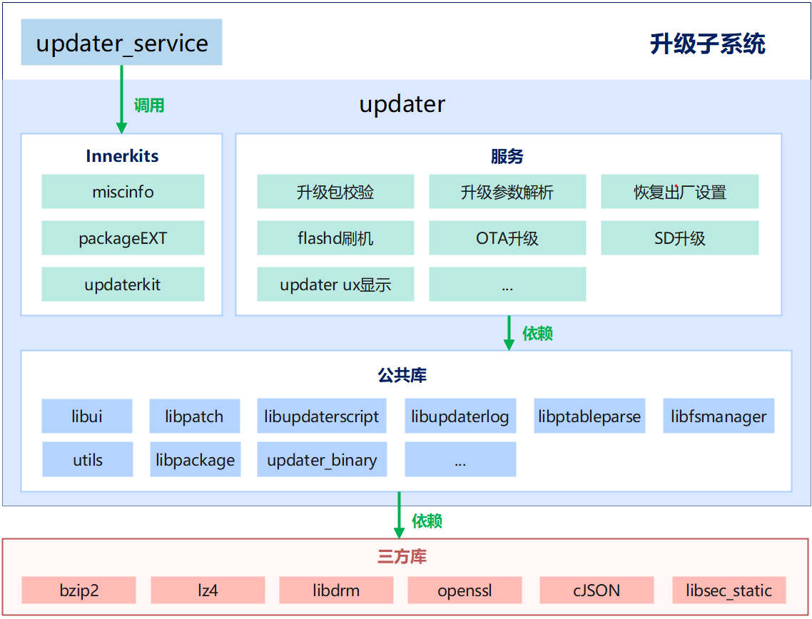

# 升级包安装组件<a name="ZH-CN_TOPIC_0000001148614629"></a>

-   [简介](#section184mcpsimp)
-   [目录](#section198mcpsimp)
-   [说明](#section218mcpsimp)
    -   [使用说明](#section220mcpsimp)

-   [相关仓](#section247mcpsimp)

## 简介<a name="section184mcpsimp"></a>

升级包安装组件运行在updater分区，其功能主要包括读取misc分区信息获取升级包状态，对升级包进行校验，确保升级包合法有效；然后从升级包中解析出升级的可执行程序，创建子进程并启动升级程序。具体升级的动作由升级脚本控制。

更多升级子系统相关概念，请参考：[升级子系统](https://gitee.com/openharmony/docs/blob/master/zh-cn/readme/%E5%8D%87%E7%BA%A7%E5%AD%90%E7%B3%BB%E7%BB%9F.md)

**图 1**  升级子系统架构图



## 目录<a name="section198mcpsimp"></a>

```
base/update/updater/
├── resources           # 升级子系统用户界面图片资源目录
├── services            # 组件服务层代码目录
│   ├── applypatch      # 升级包数据更新代码目录
│   ├── diffpatch       # 差分还原代码目录
│   ├── etc             # 启动相关配置文件目录
│   ├── flashd          # flashd模式镜像写入和升级功代码目录
│   ├── fs_manager      # 文件系统和分区管理代码目录
│   ├── hdi             # 硬件相关接口定义
│   ├── include         # 升级子系统头文件目录
│   ├── log             # 升级子系统日志模块目录
│   ├── package         # 升级包管理模块目录
│   ├── ptable_parse    # 分区表解析代码目录
│   ├── script          # 升级脚本管理目录
│   ├── ui              # 升级ui界面代码目录
│   └── updater_binary  # 升级可执行程序目录
├── interfaces
│   └── kits            # 对外模块接口定义
└── utils               # 升级子系统通用代码目录
    └── include         # 升级子系统通用函数头文件目录
```

## 说明<a name="section218mcpsimp"></a>

### 使用说明<a name="section220mcpsimp"></a>

升级包安装组件运行在updater分区里，需要如下的操作

1、创建updater分区

updater是一个独立的分区，分区大小建议不小于20MB。updater分区镜像是ext4 格式文件系统。确保系统内核ext4 文件系统的config 是打开状态。

2、创建misc分区

misc 分区中存储了升级子系统在升级过程中需要的元数据\(metadata\)，如升级命令，掉电续传记录等。 misc 分区的大小约1MB，是一个裸分区，无需制作文件系统， 升级子系统直接访问。

3、分区配置表

升级包安装组件在运行过程中，需要通过分区配置表操作分区。默认的分区配置表文件名是fstab.updater，在编译的时候，打包到升级包安装组件中。

4、升级包安装组件启动

updater分区的init 进程有单独的配置文件 init.cfg，升级包安装进程启动配置在该文件中。

5、升级包安装组件编译

a、在build/subsystem\_config.json文件添加配置。

如下：

```
"updater": {
"project": "hmf/updater",
"path": "base/update/updater",
"name": "updater",
"dir": "base/update"
},
```

b、 产品中添加需要编译的组件

以Hi3516DV300为例，在productdefine/common/products/Hi3516DV300.json 中添加updater：

```
     "updater:updater":{},
```

6、updater分区镜像编译

编译配置在build仓下，build\_updater\_image.sh 脚本中，该脚本由OHOS 编译系统调用。

## AB流式升级<a name="section218mcpsimp"></a>

用户设备并非在data分区上总是有足够的空间用于下载OTA升级包，同时用户有时候不需要进入小系统升级来影响设备体验。为了解决这些问题，OpenHarmony中添加了对AB流式升级的更新，可以在下载数据块Chunk写入备用B分区，而无需将数据块或者升级包存储到data分区；同时不需要进入updater小系统进行升级，用户设备操作在活跃A分区，更新在备用B分区。

### 关键技术<a name="section220mcpsimp"></a>

1、 支持AB分区独立升级，实现无缝更新。

2、 支持流式升级断点续传，在网络断开连接、用户操作暂停等操作后，重新点击下载并更新可以实现继续更新。

3、 支持多种安全校验，每个数据块Chunk会带有哈希校验，更新完后会对每个镜像进行完整性校验。

4、 支持异常回滚机制，确保升级失败时自动恢复到稳定分区，确保用户体验。

5、 支持流式传输数据块自定义，可以根据设备data分区大小自调整。

### 做包流程<a name="section220mcpsimp"></a>

在AB流式升级当中，修改的重点是在原AB差分或者全量升级包的基础上，对大于本文档数据大小要求的new和diff操作要进行更小的切片，并按照TLV格式把差分依赖文件都封装到update.bin文件中

1、 切割内容大于45KB的diff/new

输入参数:pkgdiff、new命令

输出结果:对于pkgdiff命令尝试生成diff文件，如果diff文件大于45KB，就把pkgdiff命令分成多个pkgdiff，直到每个pkgdiff命令的diff文件大小都小于45KB。new命令直接判断block的内容大小，不满足大小的，就分割成多个new命令

2、计算img总块除去action列表中操作的块

输入参数：action列表中所有操作过的块，img总块

输出参数：两者补集，即将需要copy的块进行升序排序，连续的组成集合，按照原有new的格式进行组合成copy命令

3、根据TLV格式封装action及diff等内容到update.bin

输入参数:transfer.list、new.dat、patch.dat

输出结果:将transfer.list每一行封装成一个chunk，依赖的内容在new.dat和patch.dat中查找，并按TLV格式生成update.bin

## 相关仓<a name="section247mcpsimp"></a>

[升级子系统](https://gitee.com/openharmony/docs/blob/master/zh-cn/readme/%E5%8D%87%E7%BA%A7%E5%AD%90%E7%B3%BB%E7%BB%9F.md)

[**update\_updater**](https://gitee.com/openharmony/update_updater)

[build](https://gitee.com/openharmony/build)

[productdefine\_common](https://gitee.com/openharmony/productdefine_common)
