# updater部件ux概述
## 功能简介
updater部件是在升级模式下的轻量小系统，ux组件是一套系统交互界面，提供OTA升级过程中的界面显示和信息提示，指导用户完成升级流程。组件不依赖ArkUI框架，无需引入JS，具有界面简洁、外部依赖少、跳转清晰的特点。
## 基本概念
- UX：User Experience，人机交互体验。<br>
- 页面：界面交互时一个画面为一个页面。<br>
- 控件：页面构成的基本单位，如按钮、文本、图片等单元。<br>
- 引擎：控件显示必要条件，完成资源初始化、队列初始化、开启刷新线程等。<br>
## 框架介绍
框架主要由业务层、UX接口层、页面管理层、控件引擎层、设备驱动层组成，总体框架如下图所示：<br>

图1 ux总体框架图<br>
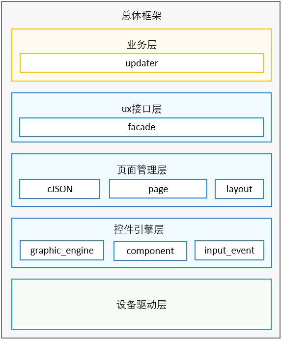
- 业务层<br>
升级过程中的业务流程，包括读取misc分区信息获取升级包状态、对升级包进行校验、确保升级包合法有效、从升级包中解析出升级的可执行程序、创建子进程并启动升级程序等。

- UX接口层<br>
其他模块访问ux的统一通道，上层进行交互显示时，通过统一的类对象入口调用ux组件进行更新。接口调用包括进度条刷新、按钮刷新、文本刷新等。

- 页面管理层<br>
人机交互过程是一组页面的组合。主要负责页面组合管理，包括页面的配置、页面解析并初始化、页面间跳转等，是组件的核心组成部分。

- 控件引擎层<br>
控件是页面的基本组成单元。主要负责控件管理，包括两部分内容。一部分是完成图像引擎的初始化，包括字体初始化、图片解码初始化、申请显示缓存空间、开启屏幕刷新线程，依赖图形子系统的基础控件库。另外一部分是触控以及点击事件的初始化，可以感知用户点击屏幕和按键按下释放等操作，也是组件的核心组成部分。

- 设备驱动层<br>
主要完成各种设备类型屏幕设备节点的初始化，以及和引擎层刷新缓存的对接，保证上层的修改可以实时刷新显示。
## 子模块介绍
1. 接口管理<br>
在业务中通过唯一的对象实例UPDATER_UI_INSTANCE进行不同接口调用来实现不同界面的刷新。
    ```c++
    if (mode == HOTA_UPDATE) {
        UPDATER_UI_INSTANCE.ShowFailedPage();
    } else {
        UPDATER_UI_INSTANCE.ShowMainpage();
        UPDATER_UI_INSTANCE.Sleep(50); /* wait for page flush 50ms */
        UPDATER_UI_INSTANCE.SaveScreen();
    }
    // Wait for user input
    while (true) {
        Utils::UsSleep(DISPLAY_TIME);
    }
    return 0;
    ```
2. 页面管理<br>
通过配置化进行页面管理，采用分层设计，config为统一入口，包含了不同类型产品的配置定义。product为特定产品的配置定义，包含了所有页面的配置定义。产品适配时可以从该入口开始梳理配置流程。有多个产品类型时，端侧在SelectConfig函数中会根据设备分辨率类型进行匹配，选择对应产品json。页面组成结构如下图所示：
    ```c++
    auto screenW = subCfg[WIDTH_KEY].As<int16_t>();
    auto screenH = subCfg[HEIGHT_KEY].As<int16_t>();
    if (!screenW.has_value() || !screenH.has_value()) {
        LOG(ERROR) << "real config file should has screenW and screenH key";
        return "";
    }
    if (screenW != Screen::GetInstance().GetWidth() || screenH != Screen::GetInstance().GetHeight()) {
        LOG(INFO) << "screen size not matched" << subConfigPath;
        continue;
    }
    LOG(INFO) << "select config: " << subConfigPath;
    return subConfigPath;
    ```
    图2 页面组成结构图<br>
    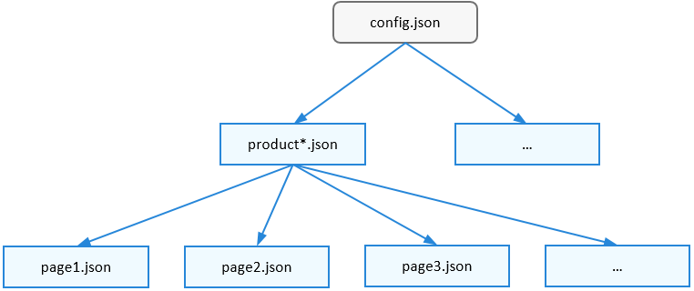
3. 控件管理<br>
控件组织形式是一个树形结构，所有控件通过链表形式组成一颗渲染树，渲染时从最上面的覆盖脏区域的节点开始进行深度优先遍历绘图。RootView会挂载所有页面，类似于绘画时的白纸。UIViewGroup为配置文件中对应的各个page页面，类似于图像的图层。UIView为各个基本的显示控件。控件也是在配置中进行管理，挂载在每个页面下，因此在每个页面的定义中也需要增加控件的配置。控件结构如下图所示：<br>
图3 控件结构示意图<br>
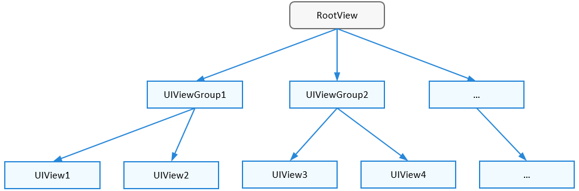
4. 事件管理<br>
事件管理包含了触控事件响应，输入管理模块PointerInputDevice读取输入位置，根据上报的坐标信息所在的脏区域找到对应的控件，根据上报的状态信息，识别为点击事件，调用控件注册对应的触控回调函数，执行对应的响应。各控件的事件也是通过配置进行管理，如果某控件需要动态响应，需要在配置中添加对应回调函数。按钮响应的流程示例如下图所示：<br>
图4 按钮响应流程示意图<br>
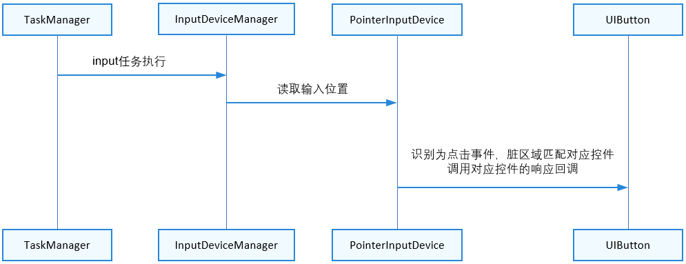
5. 资源管理<br>
资源文件是ux功能正常运行的必备条件，主要包括字体、图片、文本、配置文件。当前字体的格式为ttf文件，图片资源格式为png，文本类型为string，所有配置文件为json。界面适配主要是定制化资源文件，可以在对应模块中修改适配。资源组成结构如下图所示：<br>
图5 资源结构示意图<br>
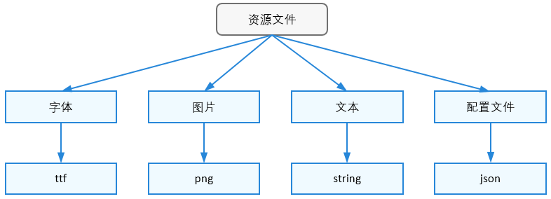
# 适配新产品RK3568
## 约束与限制
- 屏幕可以正常亮屏
- 触控屏可以正常点击感应
- 屏幕分辨率已知，以RK3568为例长宽的分辨率分别为720和1280
## 适配流程
适配过程主要是完成各种资源的初始化，流程如下图所示：<br>
图6 适配流程图<br>
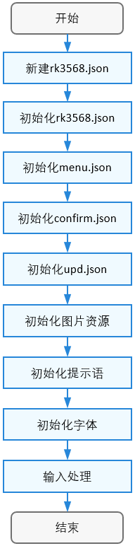
### 新建rk3568.json
进入到update_updater/resources/rk3568/pages目录。当前目录新建rk3568.json, 添加到config.json中。
```json
{
    "config" : "/resources/pages/rk3568.json"
}
```
### 初始化rk3568.json
配置产品json文件中的各个字段值，配置列表如下所示：<br>

表1 json各字段配置表
| 字段 | 值 | 含义 | 备注 |
|--|--|--|--|
| screenWidth | 720 | 屏幕宽度分辨率 | 根据实际配置 |
| screenHeight | 1280 | 屏幕长度分辨率 | 根据实际配置 |
| dir | /resources/pages | 页面资源在单板的存放路径 | 使用默认 |
| pages | ["menu.json","confirm.json","upd.json"] | 所有页面的列表 | 使用默认 |
| enableFoucs | true | 使能焦点 | 使用默认 |
| entry | menu:normal | 主菜单页面 | 使用默认 |
| strategy | 见json配置：有default、sdcard、factoryRst、rebootFactoryRst | 默认有4种策略，分别为参数升级、SD卡升级、手动恢厂、参数恢厂 | 使用默认 |
| locale | 见json配置：有res、localeFile | 单板上提示语资源存放路径、使用多语言的文件名 | 使用默认 |
| callbacks | 见json配置：有pageId、comId、type、func | 为页面控件绑定回调函数类型，如点击事件和用户进行交互 | 使用默认 |

因为pages字段中配置了3个页面，所以需要分别初始化这3个页面。

### 初始化menu.json
配置主菜单页面json文件中的各个字段值，配置列表如下所示：<br>

表2 json各字段配置表
| 字段 | 值 | 含义 | 备注 |
|--|--|--|--|
| id | menu | 主菜单页面，**值必须与上一小节中pages字段值保持一致** | 使用默认 |
| bgColor | "r":0,"g":0,"b":0,"a":255 | 背景颜色为RGBA形式 | 根据实际配置 |
| subpages | 见json配置：有id,coms,bgColor | 组成了包含的子页面，主菜单会跳转到这些子页面上 | 使用默认 |
| default | 各控件属性 | 指定了默认控件的属性参数 | 使用默认 |
| coms | type、id、x、y、w、h、fontSize、fontColor | 页面包含一组控件，定义了每个控件的基本属性，x、y、w、h确定了控件在页面上的唯一位置 | x、y、w、h、fontSize、fontColor需要根据分辨率的实际配置，其他使用默认 |

- 下面举例看看更改这些字段后的效果。
    ```json
    "id": "menu",
    "bgColor" : "#000000ff",
    "subpages" : [
         {
             "id":"normal",
             "bgColor" : "#f1f3f5ff"
    ```
     
    图7 修改前效果图<br>
    
- rk3568.json中entry字段配置为menu:normal，修改subpages中id为normal的背景色配置bgColor字段，改为绿色不透明：
    ```json
    "id": "menu",
    "bgColor" : "#000000ff",
    "subpages" : [
        {
            "id":"normal",
            "bgColor" : "#00ff00ff"
    ```
    
    修改后效果：<br>
    图8 修改后效果图<br>
    
- 接下来再更改LOGO图片的位置，当前配置如上图所示：
    ```json
    "coms": [
        {
            "type": "UIImageView",
            "id": "HarmonyOSIcon_Image",
            "x": 120,
            "y": 426,
            "w": 480,
            "h": 60,
    ```
    
    现在通过修改w、h、x、y属性移动到屏幕顶部左上角：
    ```json
    "coms": [
        {
            "type": "UIImageView",
            "id": "HarmonyOSIcon_Image",
            "x": 0,
            "y": 0,
            "w": 480,
            "h": 60,
    ```
    
    修改后效果：<br>
    图9 修改后效果图<br>
    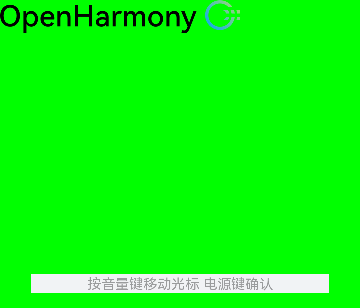<br>
其他属性的配置操作都是一样，参照以上配置即可。
### 初始化confirm.json
配置确认页面json文件中的各个字段值，配置列表如下所示：<br>

表3 json各字段配置表
| 字段 | 值 | 含义 | 备注 |
|--|--|--|--|
| id | confirm | 确认页面，**值必须与上一小节中pages字段值保持一致** | 使用默认 |
| bgColor | "r":0,"g":0,"b":0,"a":255 | 背景颜色为RGBA形式 | 根据实际配置 |
| default | 各控件属性 | 指定了默认控件的属性参数 | 使用默认 |
| coms | type、id、x、y、w、h、fontSize、fontColor | 页面包含一组控件，定义了每个控件的基本属性，x、y、w、h确定了控件在页面上的唯一位置 | x、y、w、h、fontSize、fontColor需要根据分辨率的实际配置，其他使用默认 |

- 下面举例看看更改这些字段后的效果。<br>
    ```json
    "coms": [
        {
            "type": "UILabelButton",
            "id": "Cancel_Button",
            "text": "[LABEL_NOTE_CANCEL]",
            "x": 48,
            "y": 1130,
            "w": 624,
            "h": 80,
            "fontSize": 32
        },
        {
            "type": "UILabelButton",
            "id": "Reset_Button",
            "text": "[LABEL_USER_DATA_RESET]",
            "x": 48,
            "y": 1020,
            "w": 624,
            "h": 80,
            "fontSize": 32
        }
    ```

    图10 修改前效果图<br>
    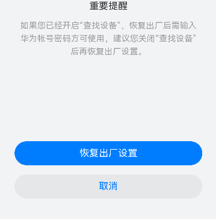
- 页面中有两个按钮，和对应的按钮配置。现在把Cancel_Button取消居中移动到左对齐，字体变大。Reset_Button移动到屏幕底部，同时字体缩小一半，修改后的配置：
    ```json
    "coms": [
        {
            "type": "UILabelButton",
            "id": "Cancel_Button",
            "text": "[LABEL_NOTE_CANCEL]",
            "x": 0,
            "y": 1130,
            "w": 624,
            "h": 80,
            "fontSize": 48
        },
        {
            "type": "UILabelButton",
            "id": "Reset_Button",
            "text": "[LABEL_USER_DATA_RESET]",
            "x": 48,
            "y": 1200,
            "w": 624,
            "h": 80,
            "fontSize": 16
        }
    ```
    
    修改后效果如下：<br>
    图11 修改后效果图<br>
    
### 初始化upd.json
配置更新页面json文件中的各个字段值，配置列表如下所示：<br>

表4 json各字段配置表
| 字段 | 值 | 含义 | 备注 |
|--|--|--|--|
| id | upd | 进度条升级页面，**值必须与上一小节中pages字段值保持一致** | 使用默认 |
| bgColor | "r":0,"g":0,"b":0,"a":255 | 背景颜色为RGBA形式 | 根据实际配置 |
| subpages | 见json配置：有id,coms,bgColor | 组成了包含的子页面，主菜单会跳转到这些子页面上，有7个跳转页面 | 使用默认 |
| default | 各控件属性 | 指定了默认控件的属性参数 | 使用默认 |
| coms | type、id、x、y、w、h、fontSize、fontColor | 页面包含一组控件，定义了每个控件的基本属性，x、y、w、h确定了控件在页面上的唯一位置 | x、y、w、h、fontSize、fontColor需要根据分辨率的实际配置，其他使用默认 |

- 同类型控件前几个小节已经介绍，下面举例看看更改进度条字段后的效果。**白色背景进度条在非安装包升级模式才有**，对应的控件id为UpdBox_Progress，修改配置时注意区分。<br>
    ```json    
    "coms": [
        {
            "type": "UIBoxProgress",
            "id": "UpdBox_Progress",
            "x": 144,
            "y": 584,
            "w": 432,
            "h": 4,
            "endPoint" : "FlashPoint_Image",
            "hasEp" : true
        },
    ```
    
    图12 修改前效果图<br>
    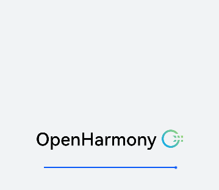
- 修改配置把进度条移动到LOGO上面，进度条宽度扩大10倍，配置如下：
    ```json
    "coms": [
        {
            "type": "UIBoxProgress",
            "id": "UpdBox_Progress",
            "x": 144,
            "y": 200,
            "w": 432,
            "h": 40,
            "endPoint" : "FlashPoint_Image",
            "hasEp" : true
        },
    ```
    
    修改后效果如下：<br>
    图13 修改后效果图<br>
    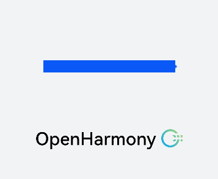
- **黑色背景进度条在安装包升级模式才有**，对应的控件id为ProgressUpdBoxDark_Progress，修改配置时注意区分。<br>
    ```json
    "coms": [
        {
            "type": "UIBoxProgress",
            "id": "ProgressUpdBoxDark_Progress",
            "x": 144,
            "y": 548,
            "w": 432,
            "h": 4,
            "bgColor" : "#262626ff",
            "fgColor" : "#b4b4b4ff",
            "endPoint" : "FlashPointDark_Image",
            "hasEp" : true
        },
    ```
    
    图14 修改前效果图<br>
    
- 修改配置颜色变更为红色，配置如下：
    ```json
    "coms": [
        {
            "type": "UIBoxProgress",
            "id": "ProgressUpdBoxDark_Progress",
            "x": 144,
            "y": 548,
            "w": 432,
            "h": 4,
            "bgColor" : "#262626ff",
            "fgColor" : "#ff0000ff",
            "endPoint" : "FlashPointDark_Image",
            "hasEp" : true
        },
    ```
    
    修改后效果如下：<br>
    图15 修改后效果图<br>
    
### 初始化图片资源
页面配置完成后，需要对资源images目录进行初始化。json文件中图片控件的resPath字段会配置为图片在设备上的路径，该路径下的资源来源于如下表格中的目录。如果需要更换这些图片资源，在此目录下替换即可。<br>

表5 图片资源目录表
| 目录 | 含义 | 备注 |
|--|--|--|
| resources/rk3568/images/icon | 主菜单LOGO图片资源 | 使用默认 |
| resources/rk3568/images/progress | 进度条图片资源 | 使用默认 |
| resources/rk3568/images/warn | 警告图片资源，升级过程中操作不当会触发警告 | 使用默认 |

### 初始化提示语
images目录适配完成后，需要适配同级目录的string文件夹。提示语通过配置文件string.json进行管理。支持中英文和西班牙语。文本控件以id形式组成一个列表。可以修改提示语值，也可以使用默认。<br>

表6 提示语配置表
| 字段 | 含义 | 备注 |
|--|--|--|
| type | 控件类型一般为文本 | 使用默认 |
| zh | 中文提示语 | 根据实际配置 |
| en | 英文提示语 | 根据实际配置 |
| spa | 西班牙提示语 | 根据实际配置 |

### 初始化字体
接下来是字体的适配。可以使用默认ttf文件。若当前字体库不满足使用场景，用准备好的ttf字体库文件替换即可，文件在目录resources/font下。

### 输入处理
最后在HdfInit函数中进行触控屏的报点读取和分发处理。在ReportEventPkgCallback函数中更新坐标点和按压状态。
```c++
for (int i = 0; i < MAX_INPUT_DEVICES; i++) {
    uint32_t idx = sta[i].devIndex;
    if ((idx == 0) || (g_inputInterface->iInputManager->OpenInputDevice(idx) == INPUT_FAILURE)) {
        continue;
    }

    LOG(INFO) << "hdf devType:" << sta[i].devType << ", devIndex:" << idx;
}

/* first param not necessary, pass default 1 */
g_callback.EventPkgCallback = ReportEventPkgCallback;
ret = g_inputInterface->iInputReporter->RegisterReportCallback(1, &g_callback);
if (ret != INPUT_SUCCESS) {
    LOG(ERROR) << "register callback failed for device 1";
    return ret;
}
```

如果输入使用了openharmony的HDF驱动框架，HdfInit函数不用修改即可完成坐标点正常获取。否则请适配该函数完成坐标点和按压状态更新。
## 调测验证
适配完成后即可编译版本刷写单板查看效果。
- 主菜单页面menu.json<br>
图16 主菜单页面效果图<br>
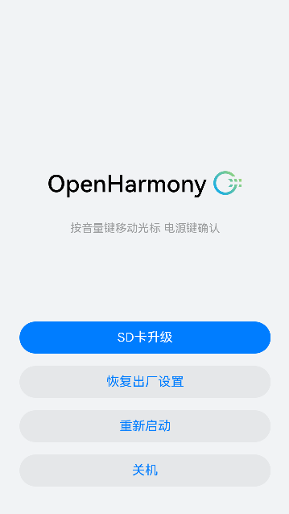
- 确认页面confirm.json<br>
图17 确认页面效果图<br>
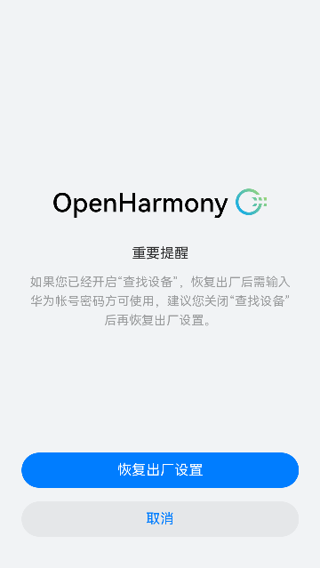
- 更新页面upd.json<br>
恢厂更新：<br>
图18 恢厂更新页面效果图<br>
<br>
安装包升级更新：<br>
图19 安装包更新页面效果图<br>

